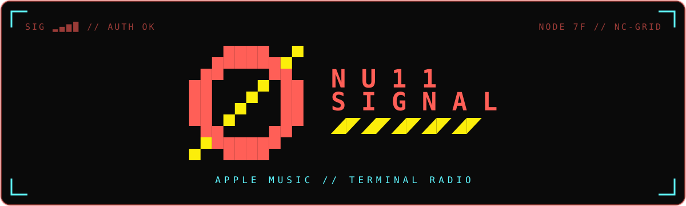
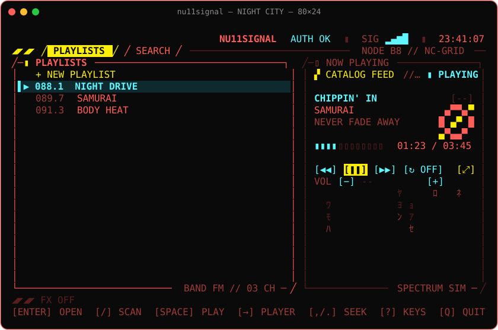
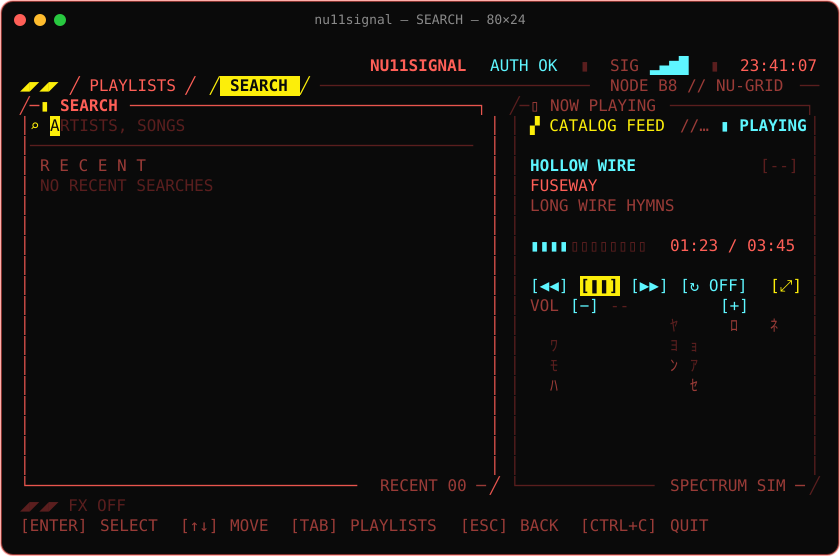
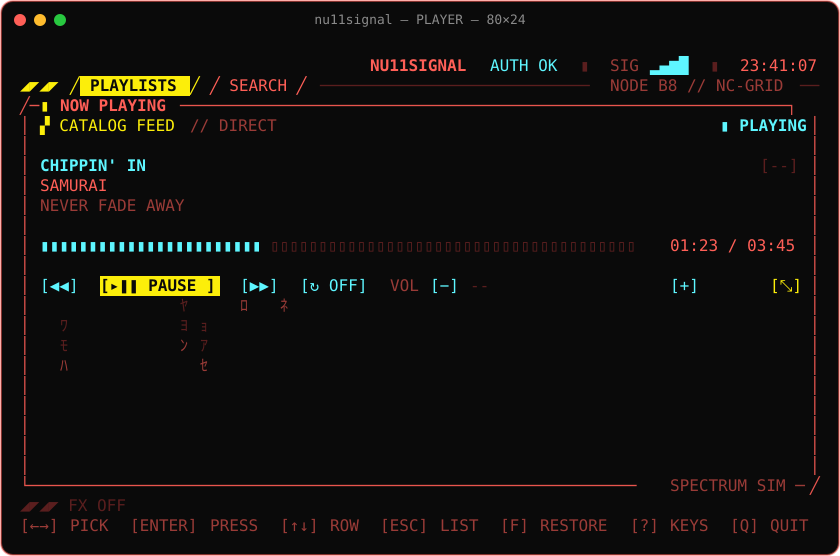
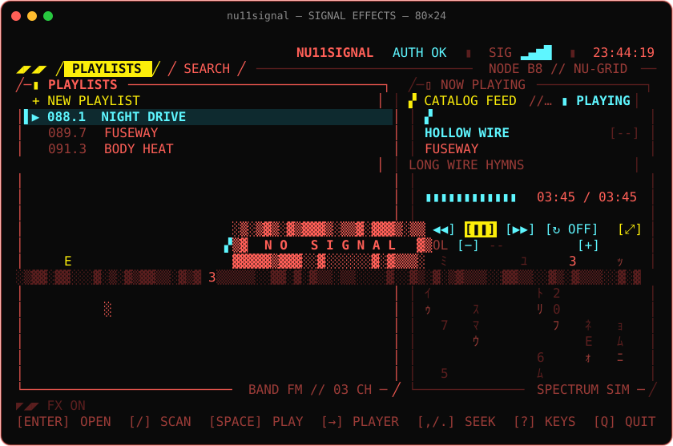
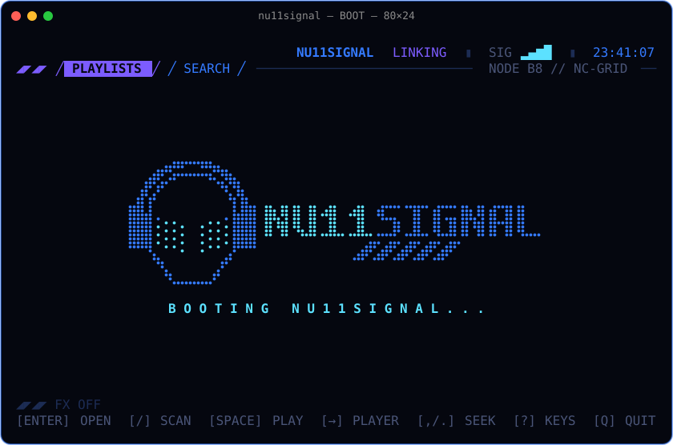
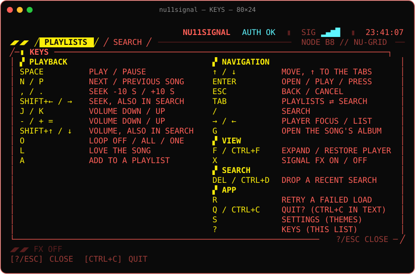
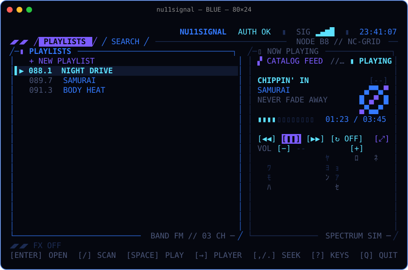

<a id="top"></a>

<div align="center">
  
</div>

<h1 align="center">nu11signal</h1>

<p align="center"><strong>A cyberpunk car radio for Apple Music, in your terminal.</strong></p>

<p align="center">
  <a href="https://github.com/wahh-22/nu11signal/releases/latest"></a>
  <a href="docs/install.md"></a>
  <a href="docs/install.md"></a>
  <a href="LICENSE"></a>
  <a href="https://github.com/wahh-22/nu11signal/stargazers"></a>
  <a href="https://github.com/wahh-22/nu11signal/commits/main"></a>
</p>

<p align="center">
  <a href="https://github.com/sponsors/wahh-22"></a>
  <a href="https://buymeacoffee.com/wahh.dev"></a>
</p>

<p align="center">
  <strong>
    <a href="https://nu11signal.wahh.dev/">Website</a>
    &nbsp;·&nbsp;
    <a href="#get-started">Quickstart</a>
    &nbsp;·&nbsp;
    <a href="#documentation">Docs</a>
    &nbsp;·&nbsp;
    <a href="https://github.com/wahh-22/nu11signal/releases">Releases</a>
    &nbsp;·&nbsp;
    <a href="#support-the-signal">Support</a>
  </strong>
</p>

<br>

<p align="center">Your library playlists sit on a pseudo FM dial, beside a now-playing panel, a volume readout, and data rain that plays the music.<br><strong>Search and browse the Apple Music catalog, edit playlists, and love songs without leaving the terminal.</strong></p>

<p align="center"><sub>It plays through a tiny windowless MusicKit helper (about 31 MB RSS measured during playback, near 0% CPU) instead of a browser.</sub></p>

<p align="center">
  
</p>

> macOS only. Requires an Apple Music subscription. Not affiliated with Apple.

## Support the signal

Nu11Signal is free and open source. If it plays in your terminal and you
want to keep it on air, you can
[sponsor on GitHub](https://github.com/sponsors/wahh-22) or
[buy me a coffee](https://buymeacoffee.com/wahh.dev).

## Features

---

### Apple Music, as a terminal radio

A Bubble Tea UI in Go talks JSON lines to a signed Swift helper that plays
through MusicKit's `ApplicationMusicPlayer`. No browser and no app window: the
helper is windowless and idles near 0% CPU.

**[Docs →](docs/architecture.md)**

---

### Your own music files too

mp3, flac, ogg and wav from `~/Music` (or the folders you name) play beside
Apple Music under a LOCAL section, folders and m3u files as playlists, with
the rain driven by the music itself. On Linux, built from source, they play
on their own.

**[Docs →](docs/usage.md#local-files)**

---

### Browse the catalog like Apple Music



Views stack like Apple Music's: PLAYLISTS → SEARCH → RESULTS → ARTIST → ALBUM,
SONG, or PLAYLIST. Live suggestions as you type, recent searches, artist pages
with top songs and discography, album and playlist pages. A song picked from a
list plays with the rest of that list queued around it.

**[Docs →](docs/usage.md#browsing-the-catalog)**

---

### Playlists and favorites

Love a song (`l`, the `<3` mark), add it to a playlist (`a`), or create a new
playlist on the spot, from any song row or the song playing. Every page reads
its songs' favorite state in one call, so the hearts show at once.

**[Docs →](docs/usage.md#editing-the-library)**

---

### Data rain that plays the music



Hex digits and half-width katakana fall under NOW PLAYING. With app volume on
macOS 15 or later the helper measures the real spectrum: loud bands rain
harder, bass hits send a wave of drops, and silence is dry. Otherwise the rain
drizzles decoratively with the playback state.

**[Docs →](docs/effects.md#rain)**

---

### Signal glitches, intros, and a boot splash



Every so often the screen loses the signal: torn rows, corrupted cells, static
bars, and now and then a red `NO SIGNAL`. New content scrambles in, and the app
boots and shuts down over the null emblem. `x` toggles the effects;
`nu11signal --calm` starts without them.



**[Docs →](docs/effects.md#signal-effects)**

---

### A HUD you can drive with keys or the mouse



Bracketed HUD buttons for transport, loop, volume, and expand; every control
answers to both the keyboard focus and a click, and the wheel scrolls the
lists. `?` opens KEYS, every binding in one panel, and quitting always asks
first.

**[Docs →](docs/usage.md#keys)** &nbsp;·&nbsp; **[Mouse →](docs/usage.md#mouse)**

---

### Themes



`s` opens SETTINGS: NIGHT CITY (neon red, cyan, and yellow) or BLUE (electric
blue and violet from the gentleman-blue palette). The whole UI recolors at
once, and the choice is saved for the next start.

**[Docs →](docs/usage.md#settings)**

---

### Its own volume

nu11signal's `VOL` is independent of the system volume: the helper taps its
own audio with a Core Audio process tap (macOS 14.2+) and plays it through a
private aggregate device, falling back to the system volume (`SYS`) when it
cannot. Set `NU11SIGNAL_VOLUME_MODE=system` to opt out.

**[Docs →](docs/audio.md#app-volume)**

---

## Get started

Install the signed, notarized build (macOS 14 or later, Apple Silicon and
Intel) with [Homebrew](https://brew.sh):

```sh
brew install --cask wahh-22/tap/nu11signal
nu11signal
```

The first launch asks for Apple Music access. The UI is designed with
[Kode Mono](https://fonts.google.com/specimen/Kode+Mono): the cask installs it
(releases after v0.2.1; by hand, `brew install --cask font-kode-mono`). Set
your terminal's font to it for the intended look; any monospaced font works. Release archives for a manual install are on
[GitHub Releases](https://github.com/wahh-22/nu11signal/releases); see
[Install](docs/install.md).

A release build checks GitHub once a day for a newer release and shows the
upgrade command on its status line; turn it off with
`NU11SIGNAL_NO_UPDATE_CHECK=1` or `"update_check": false` (see
[Update check](docs/usage.md#update-check)).

From a source checkout, try the UI against a simulated player, or build and
sign your own (see [Building from source](docs/building.md)):

```sh
make demo          # try the UI with a simulated player (no Apple Music, no signing)
make build         # signed helper + Go binary (needs the one-time setup)
bin/nu11signal     # play for real
```

## Documentation

| Guide | What it covers |
|-------|----------------|
| [Install](docs/install.md) | Homebrew, release archives, the Kode Mono font |
| [Usage](docs/usage.md) | Browsing the catalog, editing the library, every key, the mouse, settings, the update check |
| [Signal effects and rain](docs/effects.md) | Glitch bursts, boot and shutdown splashes, content intros, the rain visualizer |
| [App volume and spectrum](docs/audio.md) | The Core Audio tap behind `VOL`, and the live spectrum that drives the rain |
| [Architecture](docs/architecture.md) | Go UI and Swift helper, helper lookup, the JSON lines protocol |
| [Building from source](docs/building.md) | Requirements, one-time MusicKit signing setup, make targets |
| [Releasing](docs/releasing.md) | Signed, notarized releases and the Homebrew cask |
| [Troubleshooting](docs/troubleshooting.md) | Common failures and fixes |
| [Contributing](docs/contributing.md) | Development checks, regenerating the README art, repository notes |

## Contributing

Issues and pull requests are welcome. Start with `make demo`, and run
`make test` before opening a pull request; see
[Contributing](docs/contributing.md).

## License

MIT, see [LICENSE](LICENSE). Nu11Signal was formerly named soul-king; v0.1.0
was released under that name.

<p align="right"><a href="#top">Back to top ↑</a></p>
